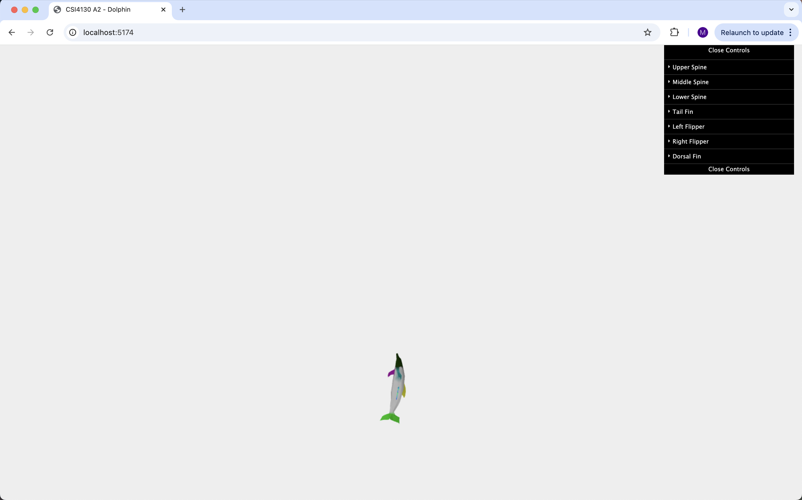

February 25, 2025<br>
Mustafa Ahmed<br>
300242013<br>

## 🐬 Meet Dolly the Dolphin! 🌊<br>

In this repository we will animate Dolly swimming around your screen as part of our solution to Assignment 2
for CSI4130.<br>
Visit the GitHib Repository: [csi4130-a2](https://github.com/mustafa-ahmed1118/csi4130-a2.git)

## Summary of Topics

- Three.js model bones
- Model skining for animations
- Animating 3D Models using bones

## Project File Structure:

```
csi4130-a2
│   README.md
|   dolphin_color.obj
│   dolphin.js
│   index.html
└───src
│   │   dolphin_screenshot.png
│   │   symphony.png
```

## Requirments:

- Python 3 to run a local host server or any equivalent.
- Node.js version 14 or later.

### Ensure the following node libraries are installed:

1. Three.js

   ```bash
   npm install --save three
   ```

2. Vite

   ```bash
   npm install --save-dev vite
   ```

3. Dat GUI
   ```bash
   npm install dat.gui --save-dev
   ```

## Overall Solution

The solution to this problem is in the `dolphin.js` file.

The solution is comprised of 1 class and 6 key functions:

- `WavePath(freqX, freqY, phaseShift, magnitude)`
- `initOcean()`
- `createSkeleton()`
- `loadDolphin()`
- `controlsGUI()`
- `animateDolphin()`
- `onResize()`

### `WavePath Class`:

This class sets up the path that Dolly will swim along. It uses the Lissajous Curve format from Lab 4.

### `initOcean()`:

Sets up the Three.js environment for Dolly to swim around (hence why it is called the ocean).

### `createSkeleton()`:

Creates Dolly's skeleton using Three.js `Bone()` objects. It consists of three spine bones, a tail bone, a dorsal fin bone, and two flipper bones.

_NOTE: I faced issues setting the bone locations properly and did not have time to adjust them properly. Admittedly, it does not reflect the anatomy of a dolphin correctly and is very crunched in the middle of the model (poor Dolly). None the less, the animation is still facilitated adequately._

### `loadDolphin()`:

Loads Dolly's mesh into the environment using the `dolphin_color.obj` file. Using the `createSkeleton()` function, it maps the bones to skin weights to facilitate the animation.

### `controlsGUI()`:

Configures a dat.gui control slider for each of Dolly's bones. _(Please recall the note from earlier regarding possible issues with the bones.)_

### `animateDolphin()`:

Animates Dolly to swim around the screen (woohoo). Using the `swimRoute` variable, it keeps her on the course laid out by the `WavePath` class. She continues facing the direction she is swimming in using the Three.js `Quaternion` object.

#### Bone animations:

The bones are individually animated from the `bones[]` array to give Dolly a swimming animation as she moves around the screen. The upper, middle, and lower spine are in the 0, 1, and 2 indexes respectively in `bones[]`. They sway and bob like a dolphin using sine functions calculated with the `swayAmplitude`, `swaySpeed`, `bobAmplitude`, and `bobSpeed` constants.

The tail bone is stored in `bones[3]`. This wags back and forth as Dolly swims once again using a sine function.

The left and right flippers are stored in the 5 and 6 indexes respectively of `bones[]`. Similar to the spine bones, they flip at a set amplitude and speed stored in the `flipperAmplitude` and `flipperSpeed` constants to facilitate an accurate swimming animation. Like before, these constants are used in sine functions to calculate the flipper animation.

### `onResize()`:

Sets up and maintains the window for rendering.

## How to Run:

1. Using your command line / terminal navigate to a directory that you would like to save the project to
2. Clone the repository:
   ```bash
   git clone https://github.com/mustafa-ahmed1118/csi4130-a2
   ```
3. Navigate into the directory:
   ```bash
   cd csi4130-a2
   ```
4. Run the project with:
   ```bash
   npx vite
   ```
5. Visit the link provided to see the animation. For example: `http://localhost:5173/`.
6. Kill the server with `CTRL + C` in your command line when done.


_Expected output of Dolly swimming with joy🐬🏝️_

# Sources:

- [Three.js Documentation - Bones](https://threejs.org/docs/#api/en/objects/Bone)
- [Three.js Documentation - Bone Skinning](https://threejs.org/docs/#api/en/objects/SkinnedMesh)
- CSI41310 Lab 4
- ChatGPT for identifying bugs and refining dolphin animation


